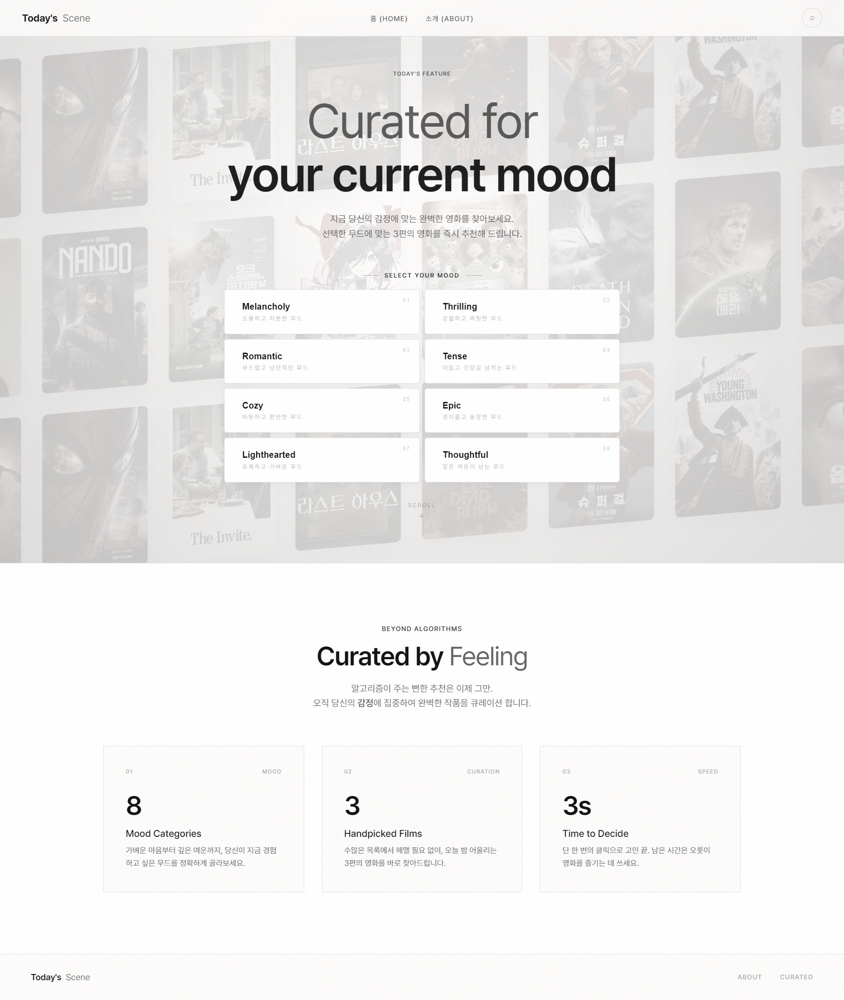

# 🎬 Today's Scene (오늘의 장면)
> "당신의 오늘 기분에 완벽하게 어울리는 단 한 편의 영화" 사용자 감정 및 무드 기반 맞춤형 영화 추천 웹 서비스, Today's Scene

## 서비스 개요

### 1. 설계 배경 및 목적
OTT 플랫폼이 폭발적으로 증가하면서 사용자는 선택 피로를 겪고 기존 알고리즘 추천은 과거 시청 기록에만 의존해 사용자의 현재 감정 상태나 무드를 반영하지 못한다는 한계를 극복하고자 기획하였습니다.

### 2. 기대 효과
- 콘텐츠 탐색 시간 단축
- 무드 기반 감성 서비스로 사용자 만족도 향상

### 3. 기능 요약
- **무드 선택 (8종)**: 현재 기분에 맞는 감정 키워드 선택
- **영화 추천**: 선택한 무드에 어울리는 영화 3편 추천
- **영화 상세 정보 확인**: 추천 영화의 상세 정보와 감성적인 UI/예고편 제공
- **서비스 소개 페이지 제공**: 기획 의도를 담은 About 페이지

---

## 🛠 기술 스택 (Tech Stack)
- **Front-end**: HTML5, CSS3, JavaScript
- **Back-end**: Java 17, Spring Boot
- **Database & ORM**: MySQL, Spring Data JPA
- **Styling**: 순수 CSS 활용 (애니메이션, 반투명 효과, 컬러 트랜지션)
- **Architecture Planning**: Mermaid (다이어그램)

---

## 📸 서비스 화면 (Screenshots)

| 메인 페이지 (무드 선택) | 영화 추천 결과 | 영화 상세 정보 | 서비스 소개 (About) |
|:---:|:---:|:---:|:---:|
|  |  |  |  |
| 감정 키워드를 직관적으로 선택 | 무드에 어울리는 영화 3편 추천 | 평점 · 예고편 확인 | 기획 의도 소개 |

